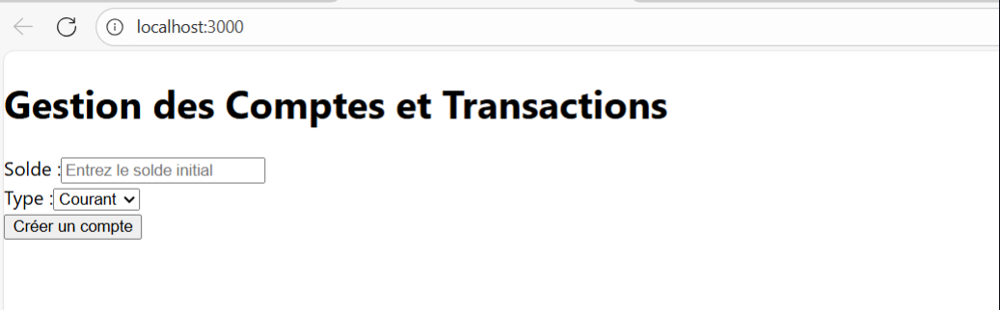

# 🏦 Application de Gestion des Comptes et Transactions

Ce projet démontre une application React front-end utilisant GraphQL (Apollo Client) et Tailwind CSS pour interagir avec une API de gestion bancaire.

## Aperçu de l'Interface

Voici une capture d'écran de l'application fonctionnelle :

---